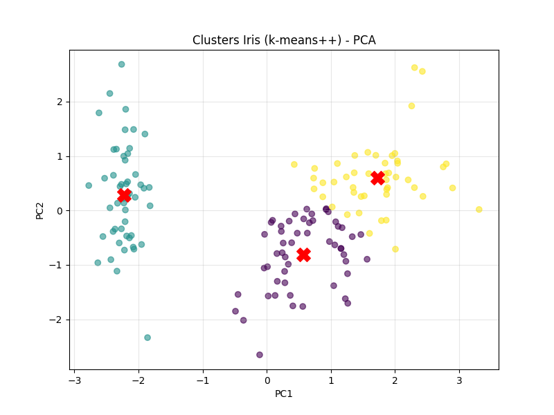
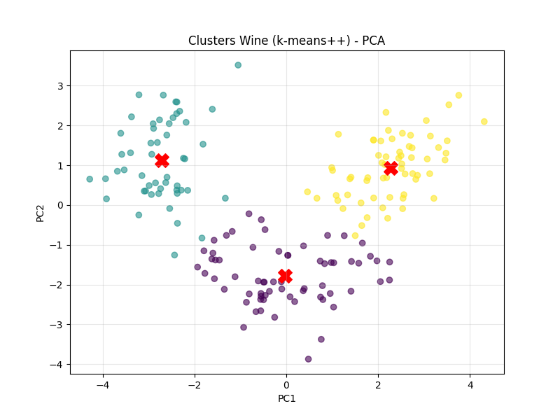
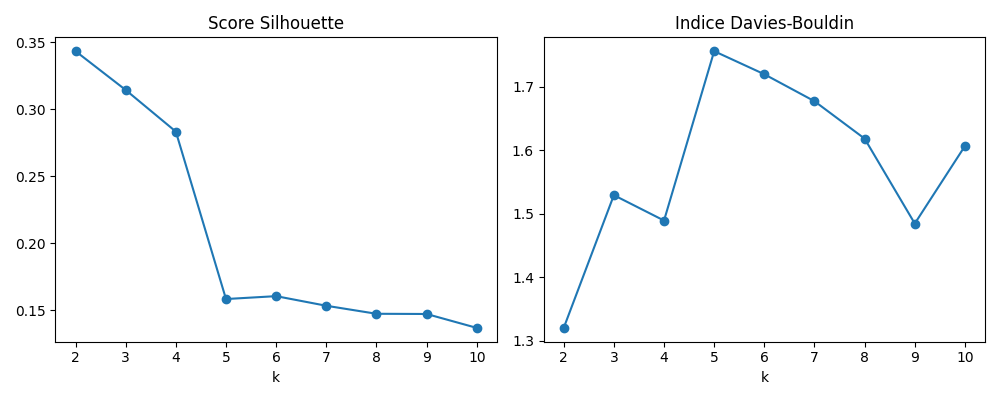
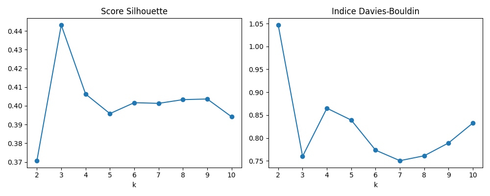

# K-Means Clustering: An Applied Unsupervised Learning Study


**Author:** Nicoleta Opre<br>
**Context:** 4ALGL4A, Academic Year 2024-2025

## Project Purpose

This project is a practical study of **K-Means clustering**, an unsupervised learning algorithm used to discover groups in data without relying on labels during training.

The goal was to build an analysis workflow that is both technically sound and interpretable:

- prepare and standardize data before applying distance-based clustering;
- compare several candidate values of `k` rather than selecting the number of clusters arbitrarily;
- evaluate cluster quality with inertia, Silhouette Score, and Davies-Bouldin Index;
- compare random Lloyd initialization with the more robust K-Means++ strategy;
- visualize high-dimensional results with Principal Component Analysis (PCA);
- use the fitted models to assign new observations to existing clusters.

This work demonstrates the complete reasoning process around a machine-learning experiment: data preparation, model selection, evaluation, visualization, and interpretation.

## Technology Stack

| Technology | Role |
| --- | --- |
| **Python** | Analysis and model implementation |
| **pandas** | DataFrames, cleaning, and tabular data preparation |
| **NumPy** | Numerical data handling through the scientific Python ecosystem |
| **scikit-learn** | Standardization, K-Means, PCA, and evaluation metrics |
| **Matplotlib** | Metric and cluster visualizations |
| **Seaborn** | Visualization support and styling |

## Datasets

The same workflow is applied to four different types of data:

| Dataset | Data profile | Selected `k` |
| --- | --- | ---: |
| [Iris](projet_kmeans/rapports/iris.md) | Flower measurements across three species | 3 |
| [Breast Cancer](projet_kmeans/rapports/breast_cancer.md) | 30 tumor measurements across 569 samples | 2 |
| [Mall Customers](projet_kmeans/rapports/mall.md) | Age and annual income for customer segmentation | 3 |
| [Wine](projet_kmeans/rapports/wine.md) | 13 chemical measurements across three wine classes | 3 |

For datasets with known labels, the labels are used only after clustering to assess agreement with the discovered groups using the Adjusted Rand Index (ARI). This keeps the training process unsupervised while adding useful context to the evaluation.

## Analysis Workflow

1. Load a dataset and inspect its structure.
2. Check for missing values and detect potential outliers with the IQR method.
3. Standardize features with `StandardScaler` so that variables with larger numerical scales do not dominate Euclidean distance.
4. Fit K-Means models for `k` values from 2 through 10.
5. Select a useful cluster count using Silhouette and Davies-Bouldin scores, together with domain context.
6. Compare `init="random"` (Lloyd) with `init="k-means++"` using inertia, Silhouette, Davies-Bouldin, and ARI where labels are available.
7. Project the results into two dimensions with PCA and visualize the observations and centroids.
8. Predict cluster assignments for representative new observations.

## Selected Results

The experiments show that preprocessing and evaluation choices matter. For example, the Wine experiment achieved an ARI of **0.897** with three clusters, while the Iris experiment achieved an ARI of **0.620** with K-Means++. These results also illustrate an important modeling point: a high-quality clustering is not guaranteed simply because the data has known categories, so multiple metrics and domain context are considered together.

### Cluster Visualizations

<p align="center">
	
	
</p>
<p align="center"><em>Examples of cluster assignments and centroids after PCA projection.</em></p>

### Model-Selection Visualizations

<p align="center">
	
	
</p>
<p align="center"><em>Comparing candidate values of <code>k</code> with complementary metrics.</em></p>

## Repository Structure

```text
projet_kmeans/
├── breast_cancer_kmeans.py   # Clustering of tumor measurements
├── iris_kmeans.py            # Clustering of flower measurements
├── mall_customers_kmeans.py  # Customer segmentation
├── wine_kmeans.py            # Clustering of chemical wine profiles
├── requirements.txt          # Python dependencies
├── images/                   # Generated metric and PCA plots
└── rapports/                 # Detailed experiment reports
```

## Getting Started

### 1. Install the dependencies

```bash
python -m venv .venv
```

Activate the environment:

```bash
# Windows PowerShell
.venv\Scripts\Activate.ps1

# macOS / Linux
source .venv/bin/activate
```

```bash
pip install -r projet_kmeans/requirements.txt
```

### 2. Run an experiment

From the repository root:

```bash
python projet_kmeans/iris_kmeans.py
python projet_kmeans/breast_cancer_kmeans.py
python projet_kmeans/wine_kmeans.py
```

The Mall Customers script expects the source CSV at `projet_kmeans/data/Mall_Customers.csv`:

```bash
python projet_kmeans/mall_customers_kmeans.py
```

The scripts print evaluation results and open Matplotlib windows for the metric and PCA plots.

## Detailed Reports

The [reports directory](projet_kmeans/rapports) contains the reasoning, intermediate checks, metric interpretation, and conclusions for each dataset.

## References

- [scikit-learn KMeans documentation](https://scikit-learn.org/stable/modules/generated/sklearn.cluster.KMeans.html)
- [scikit-learn clustering performance evaluation](https://scikit-learn.org/stable/modules/clustering.html#clustering-performance-evaluation)
- [scikit-learn PCA documentation](https://scikit-learn.org/stable/modules/generated/sklearn.decomposition.PCA.html)
