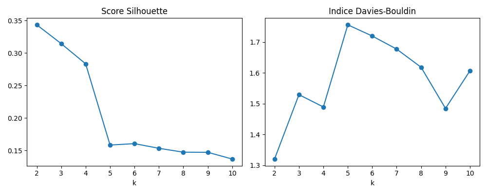
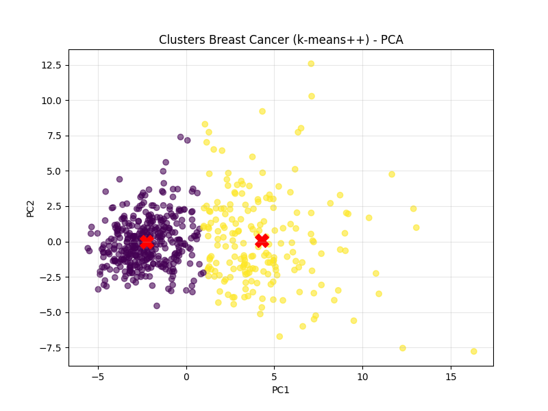

# Rapport de clustering – Dataset Breast Cancer

## 1. Contexte

Ce dataset contient des mesures de tumeurs cancéreuses, classées en malignes (0) ou bénignes (1)

## 2. Chargement et Aperçu des Données

Le dataset contient **569 échantillons** décrits par **30 caractéristiques** (taille, texture, compacité, etc.). La cible `target` indique si la tumeur est **maligne (0)** ou **bénigne (1)**.

**Extrait des premières lignes :**

```python
from sklearn.datasets import load_breast_cancer
cancer = load_breast_cancer()
X = cancer.data
y = cancer.target
...
print(cancer_df.head())
```

```text
   mean radius  mean texture  ...  worst fractal dimension  target
0        17.99         10.38  ...                  0.11890       0
1        20.57         17.77  ...                  0.08902       0
...
```

## 3. Prétraitement et Nettoyage

### Données manquantes

```python
cancer_df.isnull().sum()
```

**Résultat** : aucune valeur manquante, ce qui est idéal pour un clustering basé sur les distances.

### Détection des outliers

Utilisation de l’écart interquartile (IQR) sur les 30 variables. Un point est considéré comme aberrant s’il est en dehors de :

```
Q1 = cancer_df[feature_names].quantile(0.25)
Q3 = cancer_df[feature_names].quantile(0.75)
IQR = Q3 - Q1

out_low = Q1 - 1.5 * IQR
out_high = Q3 + 1.5 * IQR

is_outlier = (cancer_df[feature_names] < out_low) | (cancer_df[feature_names] > out_high)
outlier_rows = is_outlier.any(axis=1).sum()

print(f"\nNombre de lignes contenant au moins un outlier : {outlier_rows}")

```

➡ **171 lignes** (soit environ 30 % du dataset) contiennent au moins une valeur aberrante.

### Décision :

Nous **conservons les outliers**, car ils peuvent refléter des cas cliniques réels (par exemple, des tumeurs exceptionnellement grosses). Pour atténuer leur influence, on applique une **standardisation** :

```python
from sklearn.preprocessing import StandardScaler
scaler = StandardScaler()
X_scaled = scaler.fit_transform(X)
```

## 4. Choix du Nombre de Clusters

On évalue les partitions de **k=2 à k=10** à l’aide de deux indicateurs :

* **Silhouette Score** (maximiser)
* **Indice de Davies-Bouldin** (minimiser)


### Interprétation

* Le meilleur **score de silhouette** est obtenu pour **k = 2** (\~0.34)
* L’**indice DB** est également minimal à **k = 2**
* Cliniquement, on sait qu’il existe **2 classes** (malin / bénin)

**Conclusion** : le clustering optimal est obtenu avec **k = 2**,  cohérent à la fois numériquement et biologiquement

## 5. Comparaison Lloyd vs KMeans++

```python
# Résultats
Lloyd       - Inertie: 11595.53, Silhouette: 0.343, DB: 1.321, ARI: 0.654  
KMeans++    - Inertie: 11595.53, Silhouette: 0.343, DB: 1.321, ARI: 0.654
```

### Analyse :

* Les deux méthodes donnent les **mêmes résultats numériques**, ce qui est courant si les données ont une structure bien définie
* L’inertie identique indique que les **centres sont positionnés de façon similaire**
* L’**Adjusted Rand Index (ARI) = 0.654** → bonne concordance avec les vraies étiquettes

## 6. Visualisation des Clusters (PCA)


Application de la **PCA** (Analyse en Composantes Principales) pour réduire à 2 dimensions :

### Analyse visuelle :

* Deux groupes **clairement séparés**
* Le **cluster jaune** est plus diffus → plus grande variabilité des characteristiques de la classe
* Le groupe violet est plus compact, ce qui signifie que les tumeurs dans ce groupe ont des caractéristiques plus proches les unes des autres.
* Les croix rouges sont les centres de chaque cluster. Elles sont bien placées au cœur de chaque groupe, ce qui signifie que le modèle a trouvé des regroupements cohérents.

## 7. Prédictions sur Nouvelles Observations

```python
new_samples = [
    [14.0, 20.0, 90.0, 600.0, 0.10, 0.15, 0.08, 0.05, 0.18, 0.06,   # Échantillon 1
     0.40, 1.2, 3.0, 30.0, 0.007, 0.03, 0.04, 0.015, 0.02, 0.004,
     15.0, 25.0, 100.0, 700.0, 0.13, 0.22, 0.20, 0.10, 0.28, 0.07],

    [20.0, 22.0, 130.0, 1200.0, 0.15, 0.25, 0.18, 0.12, 0.20, 0.10, # Échantillon 2
     0.70, 1.8, 5.0, 50.0, 0.010, 0.04, 0.05, 0.02, 0.03, 0.006,
     25.0, 32.0, 170.0, 1800.0, 0.20, 0.35, 0.30, 0.15, 0.40, 0.12],

    [11.0, 12.0, 70.0, 370.0, 0.07, 0.08, 0.05, 0.03, 0.14, 0.05,   # Échantillon 3
     0.25, 0.8, 2.0, 15.0, 0.004, 0.02, 0.02, 0.01, 0.01, 0.002,
     12.0, 15.0, 80.0, 400.0, 0.09, 0.10, 0.09, 0.04, 0.20, 0.06]
]
...
kmeans_pp.predict(new_samples_scaled)
```

**Résultat :**

```text
Échantillon 1 => Cluster 0  
Échantillon 2 => Cluster 1  
Échantillon 3 => Cluster 0
```

### Interprétation :

* Échantillon 1 et 3 sont affectés au Cluster 0 : cela signifie que leurs caractéristiques ressemblent à celles des patients du premier groupe (par exemple, des tumeurs potentiellement malignes si ce cluster est associé aux cas graves).

* Échantillon 2 est affecté au Cluster 1, qui pourrait correspondre à des tumeurs bénignes si l’on fait le lien avec la séparation observée dans la PCA.

Ces résultats montrent que le modèle est capable de généraliser, c’est-à-dire de reconnaître les caractéristiques d’un nouveau cas et de l’associer au bon groupe, même si ce cas n’était pas présent dans les données d'entraînement.


Ce travail a été réalisé avec l’aide de ChatGPT, utilisé comme assistant pour rédiger le rapport et structurer le code Python 