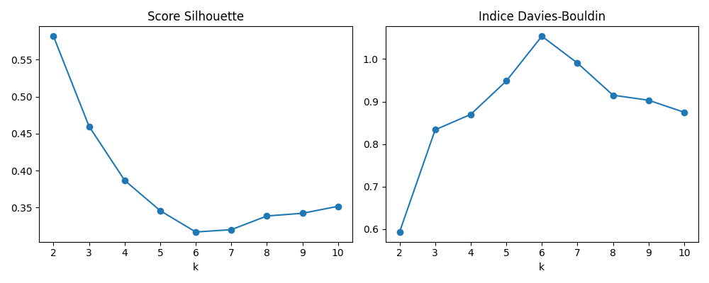
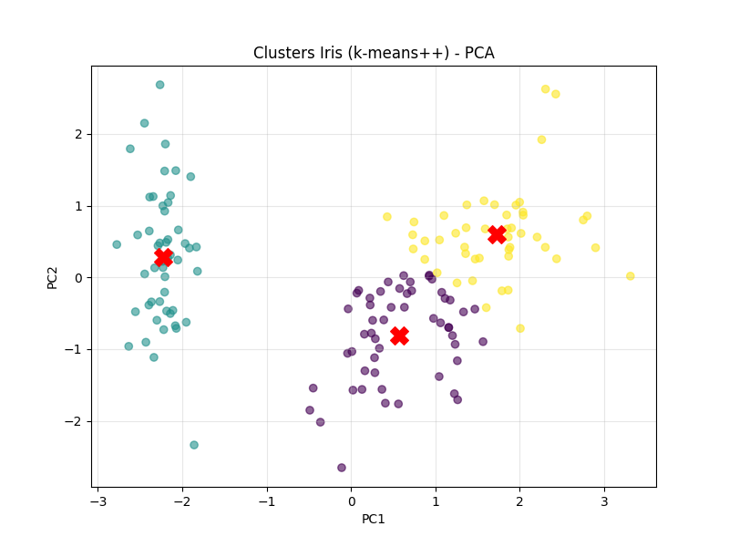

# Rapport de clustering sur le dataset **Iris**

## 1. Introduction

Ce rapport analyse le dataset Iris ( 3 types de fleures: Virginica, Setosa, Versicolor). 

## 2. Chargement et préparation des données

Le dataset Iris contient 150 observations de fleurs appartenant à trois espèces différentes. Chaque fleur est caractérisée par quatre mesures :

* Longueur et largeur des sépales
* Longueur et largeur des pétales

```python
from sklearn.datasets import load_iris
import pandas as pd

# Chargement du dataset Iris
iris = load_iris()
X = iris.data
y = iris.target
feature_names = iris.feature_names

# Création d'un DataFrame
iris_df = pd.DataFrame(X, columns=feature_names)
iris_df['target'] = y

print("Aperçu des données Iris :")
print(iris_df.head())
```

### Aperçu des données

```
Aperçu des données Iris :
   sepal length (cm)  sepal width (cm)  ...  petal width (cm)  target
0                5.1               3.5  ...               0.2       0
1                4.9               3.0  ...               0.2       0
2                4.7               3.2  ...               0.2       0
3                4.6               3.1  ...               0.2       0
4                5.0               3.6  ...               0.2       0
```

### Valeurs manquantes

Aucune valeur manquante n'a été détectée dans le dataset. C'est un point positif pour la qualité des données.

```python
# Vérification des valeurs manquantes
print("\nValeurs manquantes dans le dataset :")
print(iris_df.isnull().sum())
```

```
Valeurs manquantes dans le dataset :
sepal length (cm)    0
sepal width (cm)     0
petal length (cm)    0
petal width (cm)     0
target               0
```

### Données aberrantes (outliers)

En appliquant la méthode IQR (Interquartile Range), nous avons détecté 4 lignes contenant au moins une valeur aberrante.

```python
# Détection des outliers
Q1 = iris_df[feature_names].quantile(0.25)
Q3 = iris_df[feature_names].quantile(0.75)
IQR = Q3 - Q1

out_low = Q1 - 1.5 * IQR
out_high = Q3 + 1.5 * IQR

is_outlier = (iris_df[feature_names] < out_low) | (iris_df[feature_names] > out_high)
outlier_rows = is_outlier.any(axis=1).sum()

print(f"\nNombre de lignes contenant au moins un outlier : {outlier_rows}")
```

```
Nombre de lignes contenant au moins un outlier : 4
```

Étant donné le faible nombre d’outliers détectés et leur écart relativement faible par rapport aux autres valeurs (4 lignes / 150 ), je fais le choix de ne pas les traiter dans cette analyse.
Avec si peu d’anomalies, l’algorithme K-Means, basé sur des moyennes globales, ne devrait pas en être significativement affecté.

## 3. Prétraitement

Les données sont standardisées avec `StandardScaler` pour assurer que chaque caractéristique contribue de manière équilibrée à la distance euclidienne utilisée par KMeans.

```python
from sklearn.preprocessing import StandardScaler

scaler = StandardScaler()
X_scaled = scaler.fit_transform(X)
```

## 4. Choix du nombre optimal de clusters

Nous avons testé les valeurs de `k` allant de 2 à 10. Pour chaque `k`, nous avons calculé :

* Le score **Silhouette** (plus il est grand, mieux c'est)
* L'indice **Davies-Bouldin** (plus il est petit, mieux c'est)

```python
import matplotlib.pyplot as plt
from sklearn.cluster import KMeans
from sklearn.metrics import silhouette_score, davies_bouldin_score

K = range(2, 11)
silhouettes = []
db_scores = []

for k in K:
    kmeans = KMeans(n_clusters=k, init='k-means++', n_init=10, random_state=42)
    labels = kmeans.fit_predict(X_scaled)
    silhouettes.append(silhouette_score(X_scaled, labels))
    db_scores.append(davies_bouldin_score(X_scaled, labels))

plt.figure(figsize=(10, 4))
plt.subplot(1, 2, 1)
plt.plot(K, silhouettes, marker='o')
plt.title("Score Silhouette")
plt.xlabel("k")

plt.subplot(1, 2, 2)
plt.plot(K, db_scores, marker='o')
plt.title("Indice Davies-Bouldin")
plt.xlabel("k")
plt.tight_layout()
plt.show()
```

### Graphiques



#### Analyse des métriques

* Le score Silhouette est maximal pour k = 2, ce qui indique une séparation nette entre deux groupes. Cependant, cela ne respecte pas la structure biologique connue des données (3 espèces).

* L'indice Davies-Bouldin est le plus bas pour k = 3, ce qui suggère que les clusters sont les plus compacts et bien séparés à ce niveau.

##### Comparaison avec le k biologique

* Biologiquement, nous savons que le dataset Iris contient 3 espèces différentes : Setosa, Versicolor et Virginica. Ainsi, bien que le score Silhouette favorise k = 2, la cohérence biologique et l'indice Davies-Bouldin confirment que k = 3 est le choix optimal.

→ Conclusion : En considérant à la fois les métriques quantitatives et la structure réelle des données, nous retenons k = 3 comme nombre optimal de clusters.
## 5. Comparaison Lloyd vs KMeans++ (k=3)
Cette section vise à comparer deux méthodes d'initialisation de l'algorithme KMeans :

* Lloyd (init='random'), où les centroïdes sont initialisés aléatoirement.

* KMeans++ (init='k-means++'), qui choisit les centroïdes initiaux de manière plus intelligente pour améliorer la convergence.

Les deux algorithmes sont comparés selon quatre métriques :

* Inertie : somme des distances quadratiques entre chaque point et son centroïde.

* Silhouette : qualité des regroupements (plus proche de 1 = meilleur).

* Davies-Bouldin : qualité de séparation et compacité des clusters (plus bas = meilleur).

* Adjusted Rand Index (ARI) : comparaison avec les vraies étiquettes.

Les résultats montrent que KMeans++ est légèrement meilleur que Lloyd sur tous les critères.
```python
from sklearn.metrics import adjusted_rand_score

k_final = 3

# Lloyd (init random)
kmeans_lloyd = KMeans(n_clusters=k_final, init='random', n_init=10, random_state=42)
labels_lloyd = kmeans_lloyd.fit_predict(X_scaled)
inertia_lloyd = kmeans_lloyd.inertia_
silhouette_lloyd = silhouette_score(X_scaled, labels_lloyd)
db_lloyd = davies_bouldin_score(X_scaled, labels_lloyd)
ari_lloyd = adjusted_rand_score(y, labels_lloyd)

# k-means++
kmeans_pp = KMeans(n_clusters=k_final, init='k-means++', n_init=10, random_state=42)
labels_pp = kmeans_pp.fit_predict(X_scaled)
inertia_pp = kmeans_pp.inertia_
silhouette_pp = silhouette_score(X_scaled, labels_pp)
db_pp = davies_bouldin_score(X_scaled, labels_pp)
ari_pp = adjusted_rand_score(y, labels_pp)

print("\n--- Comparaison Lloyd vs KMeans++ (k=3) ---")
print(f"Lloyd       - Inertie: {inertia_lloyd:.2f}, Silhouette: {silhouette_lloyd:.3f}, DB: {db_lloyd:.3f}, ARI: {ari_lloyd:.3f}")
print(f"KMeans++    - Inertie: {inertia_pp:.2f}, Silhouette: {silhouette_pp:.3f}, DB: {db_pp:.3f}, ARI: {ari_pp:.3f}")
```

```
--- Comparaison Lloyd vs KMeans++ (k=3) ---
Lloyd       - Inertie: 139.83, Silhouette: 0.459, DB: 0.834, ARI: 0.610
KMeans++    - Inertie: 139.82, Silhouette: 0.460, DB: 0.834, ARI: 0.620
```

## 6. Visualisation

Les résultats des clusters sont projetés sur les deux premières composantes principales (PCA).



```python
from sklearn.decomposition import PCA

pca = PCA(n_components=2)
X_pca = pca.fit_transform(X_scaled)
centroids_pca = pca.transform(kmeans_pp.cluster_centers_)

plt.figure(figsize=(8, 6))
plt.scatter(X_pca[:, 0], X_pca[:, 1], c=labels_pp, cmap='viridis', alpha=0.6)
plt.scatter(centroids_pca[:, 0], centroids_pca[:, 1], c='red', marker='X', s=200)
plt.title("Clusters Iris (k-means++) - PCA")
plt.xlabel("PC1")
plt.ylabel("PC2")
plt.grid(True, alpha=0.3)
plt.show()
```
Chaque point est coloré selon son cluster, et les centroïdes sont représentés par des croix rouges. Cette visualisation permet de :

* Vérifier la séparation visuelle des groupes.

* Observer si les clusters ont une structure compacte.

On remarque ici que dans le graphique avec les 3 clusters, les points mauve et jaune sont fortement collés, et que la frontière n'est pas claire.
Ca c'est produit à cause du fait que les 2 types de fleures: Virginica et Versicolor) ont des characteristiques qui se ressemblent fortement.
C'est pourquoi Kmeans nous prédit ici un nombre idéal de cluster à 2, car il réunit ces 2 groupes distincts en 1 seul groupe, dûe au rapprochement des points de ces deux groupes.

Il est donc pas anormal que Kmeans trouve comme valeur de cluster 2.

---

### Prédictions 

Cette section teste la capacité du modèle entraîné à affecter de nouvelles observations à un cluster.

Trois échantillons sont fournis au modèle, et celui-ci prédit leur appartenance à l’un des trois clusters.


```python
new_samples = [
[5.1, 3.5, 1.4, 0.2],
[6.3, 3.3, 4.7, 1.6],
[7.0, 3.2, 6.0, 1.8]
]

new_samples_scaled = scaler.transform(new_samples)
predictions = kmeans_pp.predict(new_samples_scaled)

print("\nPrédictions pour de nouvelles fleurs :")
for i, (sample, cluster) in enumerate(zip(new_samples, predictions)):
print(f"Fleur {i+1}: {sample} => Cluster {cluster}")
```

```
Prédictions pour de nouvelles fleurs :
Fleur 1: [5.1, 3.5, 1.4, 0.2] => Cluster 1
Fleur 2: [6.3, 3.3, 4.7, 1.6] => Cluster 2
Fleur 3: [7.0, 3.2, 6.0, 1.8] => Cluster 2
```
Les résultats montrent que :

* La première fleur (Setosa typique) est classée dans le cluster 1.

* Les deux autres (Versicolor ou Virginica) sont regroupées dans le cluster 2, montrant une certaine proximité de ces espèces selon les mesures.
  

Ce travail a été réalisé avec l’aide de ChatGPT, utilisé comme assistant pour rédiger le rapport et structurer le code Python 