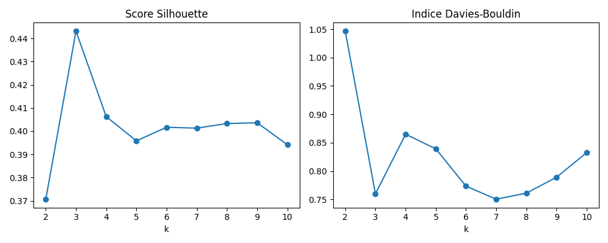
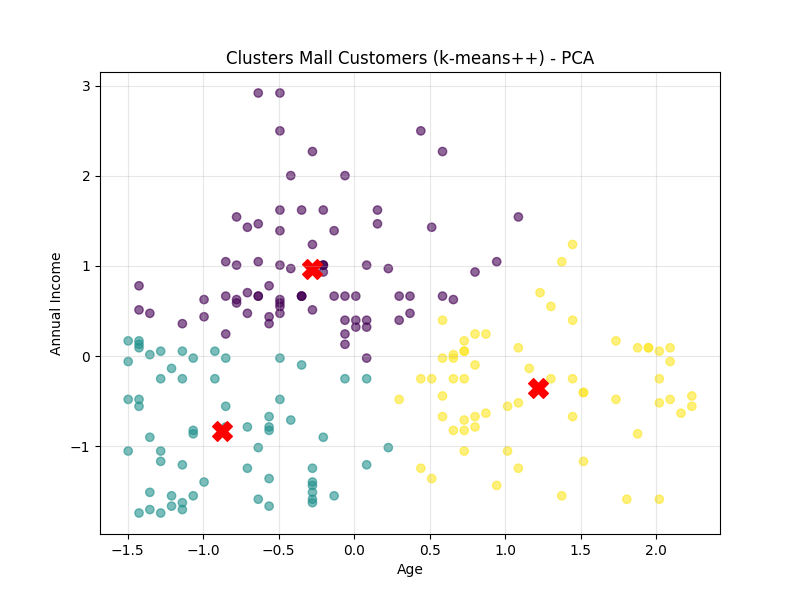

# Rapport de clustering sur le dataset **Mall Customers**

## 1. Introduction

Ce rapport contient les résultats d’une segmentation de clients basée sur leurs données démographiques, issues du dataset Mall Customers

> **Remarque importante** : pour cette analyse, nous avons choisi de ne conserver que deux variables : **l'âge** (`Age`) et le **revenu annuel** (`Annual Income (k$)`). Ces deux dimensions sont à la fois facilement interprétables et pertinentes pour distinguer différents profils de clients (jeunes, âgés, revenus faibles ou élevés). Cela permet aussi une **visualisation claire en 2D** des clusters.

## 2. Chargement et aperçu des données

```python
X = pd.read_csv("data/Mall_Customers.csv")
if 'CustomerID' in X.columns:
    X.drop('CustomerID', axis=1, inplace=True)
if 'Genre' in X.columns:
    X['Genre'] = X['Genre'].map({'Male': 0, 'Female': 1})

print("Aperçu des données Mall :")
print(X.head())
```
Ici, on efface la colonne CustomerID qui ne nous sert à rien dans l'analyse de données et on transforme la colonne Genre dans des données numériques.

```
Aperçu des données Mall :
   Age  Annual Income (k$)
0   19                  15
1   21                  15
2   20                  16
3   23                  16
4   31                  17
```

## 3. Préparation des données

### Valeurs manquantes

```python
print(X.isnull().sum())
```

```
Age                   0
Annual Income (k$)    0
```

→ Aucune valeur manquante.

### Détection des outliers (IQR)

```python
Q1 = X.quantile(0.25)
Q3 = X.quantile(0.75)
IQR = Q3 - Q1
out_low = Q1 - 1.5 * IQR
out_high = Q3 + 1.5 * IQR

is_outlier = (X < out_low) | (X > out_high)
outlier_rows = is_outlier.any(axis=1).sum()
print(f"\nNombre de lignes contenant au moins un outlier : {outlier_rows}")
```

```
Nombre de lignes contenant au moins un outlier : 2
```

→ Il n’y a que **2 valeurs aberrantes**. Leur impact est donc négligeable sur la qualité du clustering. Elles sont conservées car elles peuvent refléter des cas réels (clients atypiques). 

## 4. Choix du nombre optimal de clusters

Nous évaluons plusieurs valeurs de `k` (de 2 à 10) avec deux métriques :

* **Score Silhouette** (plus haut = mieux)
* **Indice Davies-Bouldin** (plus bas = mieux)

```python
scaler = StandardScaler()
X_scaled = scaler.fit_transform(X)

K = range(2, 11)
silhouettes = []
db_scores = []

for k in K:
    kmeans = KMeans(n_clusters=k, init='k-means++', n_init=10, random_state=42)
    labels = kmeans.fit_predict(X_scaled)
    silhouettes.append(silhouette_score(X_scaled, labels))
    db_scores.append(davies_bouldin_score(X_scaled, labels))
```

Graphique des scores :



### Interprétation

* Le **score Silhouette** est le plus élevé pour **k = 3**.
* L'**indice Davies-Bouldin** est le plus bas pour **k = 3**, ce qui confirme un bon équilibre entre séparation et compacité des clusters.

→ k = 3 est retenu comme valeur optimale pour cette analyse. Cela revient à diviser les clients en trois groupes selon leurs profils d'âge ou de revenu : par exemple, jeunes clients à revenu faible, jeunes clients à revenu élevé, et clients plus âgés à revenu plus modeste. Ces catégories couvrent différentes tranches d’âge et de revenus, et ne se limitent donc pas uniquement aux jeunes. : par exemple, jeunes clients à revenu faible, jeunes clients à revenu élevé, et clients plus âgés à revenu plus modeste. 

## 5. Comparaison Lloyd vs KMeans++ (k=3)

```python
k_final = 3

kmeans_lloyd = KMeans(n_clusters=k_final, init='random', n_init=10, random_state=42)
labels_lloyd = kmeans_lloyd.fit_predict(X_scaled)
inertia_lloyd = kmeans_lloyd.inertia_
silhouette_lloyd = silhouette_score(X_scaled, labels_lloyd)
db_lloyd = davies_bouldin_score(X_scaled, labels_lloyd)

kmeans_pp = KMeans(n_clusters=k_final, init='k-means++', n_init=10, random_state=42)
labels_pp = kmeans_pp.fit_predict(X_scaled)
inertia_pp = kmeans_pp.inertia_
silhouette_pp = silhouette_score(X_scaled, labels_pp)
db_pp = davies_bouldin_score(X_scaled, labels_pp)

print("\n--- Comparaison Lloyd vs KMeans++ (k=3) ---")
print(f"Lloyd       - Inertie: {inertia_lloyd:.2f}, Silhouette: {silhouette_lloyd:.3f}, DB: {db_lloyd:.3f}")
print(f"KMeans++    - Inertie: {inertia_pp:.2f}, Silhouette: {silhouette_pp:.3f}, DB: {db_pp:.3f}")
```

```
--- Comparaison Lloyd vs KMeans++ (k=3) ---
Lloyd       - Inertie: 132.86, Silhouette: 0.443, DB: 0.760
KMeans++    - Inertie: 132.86, Silhouette: 0.443, DB: 0.760
```

→ Les deux méthodes produisent des résultats strictement identiques, ce qui confirme une structure bien définie des clusters.

## 6. Visualisation des clusters

```python
plt.figure(figsize=(8, 6))
plt.scatter(X_scaled[:, 0], X_scaled[:, 1], c=labels_pp, cmap='viridis', alpha=0.6)
plt.scatter(kmeans_pp.cluster_centers_[:, 0], kmeans_pp.cluster_centers_[:, 1], c='red', marker='X', s=200)
plt.title("Clusters Mall Customers (k-means++) - PCA")
plt.xlabel("Age")
plt.ylabel("Annual Income")
plt.grid(True, alpha=0.3)
plt.show()
```



### Analyse visuelle

Le graphique ci-dessus montre trois groupes distincts :

* Les **deux centroïdes à gauche** représentent des **jeunes clients** (valeurs d'âge faibles).

  * L’un a un revenu faible (en bas à gauche).
  * L’autre un revenu élevé (plus haut sur l’axe du revenu).
* Le **centre à droite** regroupe les **clients plus âgés** avec un **revenu plus modeste** (âge élevé, revenu moyen-faible).

→ Cela montre que l’algorithme a identifié des segments cohérents : jeunes à petit ou grand pouvoir d'achat, et clients plus âgés au profil plus homogène.

## 7. Prédictions pour de nouveaux clients

```python
new_customers = [
    [25, 40],
    [27, 75],
    [60, 30]
]

new_customers_df = pd.DataFrame(new_customers, columns=X.columns)
new_customers_scaled = scaler.transform(new_customers_df)
predictions_customers = kmeans_pp.predict(new_customers_scaled)

for i, (sample, cluster) in enumerate(zip(new_customers, predictions_customers)):
    print(f"Nouveau client {i+1}: {sample} => Cluster {cluster}")
```

```
Prédictions pour les nouveaux clients explicites :
Nouveau client 1: [25, 40] => Cluster 1
Nouveau client 2: [27, 75] => Cluster 0
Nouveau client 3: [60, 30] => Cluster 2
```

→ Le modèle est capable d’**assigner chaque nouveau profil client** à l’un des segments existants. Cela peut aider à personnaliser les offres en fonction du groupe auquel appartient un client.

---

Ce rapport met en évidence une segmentation simple mais efficace en fonction de l'âge et du revenu, avec des clusters clairs, bien séparés et facilement interprétables.

Ce travail a été réalisé avec l’aide de ChatGPT, utilisé comme assistant pour rédiger le rapport et structurer le code Python 
