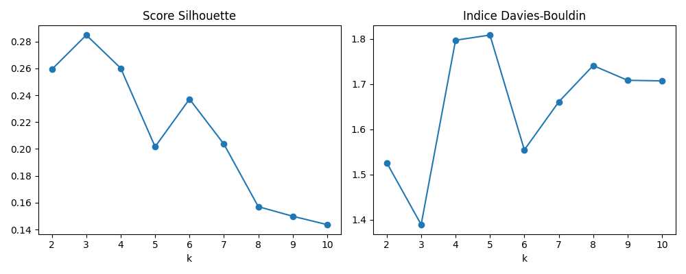
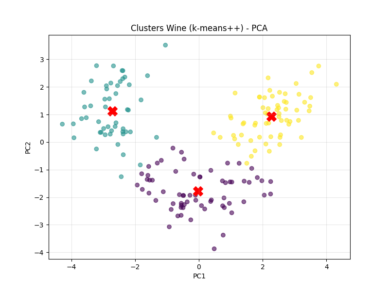

# Rapport de clustering sur le dataset **Wine**

## 1. Introduction

 Ce rapport contient les résultats d’analyses chimiques de vins à partir de trois types de cépages (ou classes de vin: classe 0, 1 et 2).

## 2. Chargement et exploration initiale

Le dataset Wine est chargé via load_wine() de sklearn.datasets. Les données sont mises sous forme de DataFrame pour faciliter l'affichage et les manipulations. Chaque ligne correspond à un vin, avec ses caractéristiques chimiques.
* On obtient  178 lignes (echantillons) 
* et 13 variables: Alcohol, Malic acid, Ash, Alcalinity of ash, Magnesium, Total phenols, Flavanoids, Nonflavanoid phenols, Proanthocyanins, Color intensity, Hue, OD280/OD315 of diluted wines, Proline

```python
from sklearn.datasets import load_wine
import pandas as pd

wine = load_wine()
X = wine.data
y = wine.target
feature_names = wine.feature_names

wine_df = pd.DataFrame(X, columns=feature_names)
wine_df['target'] = y

print("Aperçu des données Wine :")
print(wine_df.head())
```

```
Aperçu des données Wine :
   alcohol  malic_acid   ash  ...  od280/od315_of_diluted_wines  proline  target
0    14.23        1.71  2.43  ...                          3.92   1065.0       0
1    13.20        1.78  2.14  ...                          3.40   1050.0       0
2    13.16        2.36  2.67  ...                          3.17   1185.0       0
3    14.37        1.95  2.50  ...                          3.45   1480.0       0
4    13.24        2.59  2.87  ...                          2.93    735.0       0
```

## 3. Nettoyage des données

### Valeurs manquantes

Valeurs manquantes : on vérifie s’il manque des données. Ici, aucun attribut ne contient de valeur manquante.

```python
print("\nValeurs manquantes dans le dataset :")
print(wine_df.isnull().sum())
```


```
Valeurs manquantes dans le dataset :
alcohol                         0
malic_acid                      0
ash                             0
alcalinity_of_ash               0
magnesium                       0
total_phenols                   0
flavanoids                      0
nonflavanoid_phenols            0
proanthocyanins                 0
color_intensity                 0
hue                             0
od280/od315_of_diluted_wines    0
proline                         0
target                          0
```

Aucune valeur manquante n’est présente.

### Détection des outliers (IQR)

Outliers : on utilise la méthode IQR (Interquartile Range) pour détecter les valeurs extrêmement différentes des autres. Cela permet d'identifier les points qui pourraient perturber l’apprentissage.

```python
Q1 = wine_df[feature_names].quantile(0.25)
Q3 = wine_df[feature_names].quantile(0.75)
IQR = Q3 - Q1
out_low = Q1 - 1.5 * IQR
out_high = Q3 + 1.5 * IQR

is_outlier = (wine_df[feature_names] < out_low) | (wine_df[feature_names] > out_high)
outlier_rows = is_outlier.any(axis=1).sum()

print(f"\nNombre de lignes contenant au moins un outlier : {outlier_rows}")
```

```
Nombre de lignes contenant au moins un outlier : 17
```

Étant donné le faible nombre d’outliers détectés et leur écart relativement faible par rapport aux autres valeurs (17 lignes / 178 lignes ), je fais le choix de ne pas les traiter dans cette analyse.
Avec si peu d’anomalies, l’algorithme K-Means, basé sur des moyennes globales, ne devrait pas en être significativement affecté.


## 4. Détermination du nombre optimal de clusters

Nous évaluons les valeurs de `k` de 2 à 10 avec deux métriques :

* Score **Silhouette** (maximal = meilleur)
* Indice **Davies-Bouldin** (minimal = meilleur)

```python
from sklearn.preprocessing import StandardScaler
from sklearn.metrics import silhouette_score, davies_bouldin_score
from sklearn.cluster import KMeans

scaler = StandardScaler()
X_scaled = scaler.fit_transform(X)

K = range(2, 11)
silhouettes = []
db_scores = []

for k in K:
    kmeans = KMeans(n_clusters=k, init='k-means++', n_init=10, random_state=42)
    labels = kmeans.fit_predict(X_scaled)
    silhouettes.append(silhouette_score(X_scaled, labels))
    db_scores.append(davies_bouldin_score(X_scaled, labels))

# Affichage des scores
import matplotlib.pyplot as plt

plt.figure(figsize=(10, 4))
plt.subplot(1, 2, 1)
plt.plot(K, silhouettes, marker='o')
plt.title("Score Silhouette")
plt.xlabel("k")

plt.subplot(1, 2, 2)
plt.plot(K, db_scores, marker='o')
plt.title("Indice Davies-Bouldin")
plt.xlabel("k")
plt.tight_layout()
plt.show()
```



### Analyse des résultats

* Le **score Silhouette** est **maximal pour k = 3**, indiquant une bonne séparation.
* L’**indice Davies-Bouldin** est **minimal pour k = 3** également, ce qui confirme la qualité des clusters.
* Le nombre de classes réelles dans le dataset est aussi **3** pour 3 classes de vin.

→ **Conclusion** : Les deux métriques concordent avec la structure biologique : **k optimal = 3**.

## 5. Comparaison Lloyd vs KMeans++ (k=3)

```python
from sklearn.metrics import adjusted_rand_score

k_final = 3

# Méthode Lloyd
kmeans_lloyd = KMeans(n_clusters=k_final, init='random', n_init=10, random_state=42)
labels_lloyd = kmeans_lloyd.fit_predict(X_scaled)
inertia_lloyd = kmeans_lloyd.inertia_
silhouette_lloyd = silhouette_score(X_scaled, labels_lloyd)
db_lloyd = davies_bouldin_score(X_scaled, labels_lloyd)
ari_lloyd = adjusted_rand_score(y, labels_lloyd)

# Méthode KMeans++
kmeans_pp = KMeans(n_clusters=k_final, init='k-means++', n_init=10, random_state=42)
labels_pp = kmeans_pp.fit_predict(X_scaled)
inertia_pp = kmeans_pp.inertia_
silhouette_pp = silhouette_score(X_scaled, labels_pp)
db_pp = davies_bouldin_score(X_scaled, labels_pp)
ari_pp = adjusted_rand_score(y, labels_pp)

print("\n--- Comparaison Lloyd vs KMeans++ (k=3) ---")
print(f"Lloyd       - Inertie: {inertia_lloyd:.2f}, Silhouette: {silhouette_lloyd:.3f}, DB: {db_lloyd:.3f}, ARI: {ari_lloyd:.3f}")
print(f"KMeans++    - Inertie: {inertia_pp:.2f}, Silhouette: {silhouette_pp:.3f}, DB: {db_pp:.3f}, ARI: {ari_pp:.3f}")
```

```
--- Comparaison Lloyd vs KMeans++ (k=3) ---
Lloyd       - Inertie: 1277.93, Silhouette: 0.285, DB: 1.389, ARI: 0.897
KMeans++    - Inertie: 1277.93, Silhouette: 0.285, DB: 1.389, ARI: 0.897
```

**Interprétation** :
Dans l'algorithme KMeans, le résultat peut varier selon la façon dont les centres de clusters sont initialisés.

* Lloyd commence par choisir ces centres au hasard.

* KMeans++, au contraire, choisit les premiers centres de façon plus stratégique pour éviter de mauvaises répartitions.

Mais ici, les deux méthodes donnent exactement les mêmes résultats (même inertie, silhouette, Davies-Bouldin et ARI). Cela signifie que :

* Les données sont clairement structurées, avec des groupes bien séparés.

* Peu importe le point de départ, l’algorithme converge vers le même regroupement final.

## 6. Visualisation des clusters

```python
from sklearn.decomposition import PCA

pca = PCA(n_components=2)
X_pca = pca.fit_transform(X_scaled)
centroids_pca = pca.transform(kmeans_pp.cluster_centers_)

plt.figure(figsize=(8, 6))
plt.scatter(X_pca[:, 0], X_pca[:, 1], c=labels_pp, cmap='viridis', alpha=0.6)
plt.scatter(centroids_pca[:, 0], centroids_pca[:, 1], c='red', marker='X', s=200)
plt.title("Clusters Wine (k-means++) - PCA")
plt.xlabel("PC1")
plt.ylabel("PC2")
plt.grid(True, alpha=0.3)
plt.show()
```


Le graphique montre trois groupes de données bien séparés, mais avec quelques points en périphérie qui pourraient indiquer un certain chevauchement. Cela reste cohérent avec la complexité des données du vin.

## 7. Prédictions sur de nouveaux échantillons

```python
new_samples = [
    [13.2, 2.77, 2.51, 18.5, 98.0, 2.2, 1.28, 0.26, 1.56, 5.68, 1.12, 3.48, 650], # vin 1 
    [12.4, 1.9, 2.2, 19.0, 100.0, 2.0, 1.2, 0.3, 1.5, 4.2, 1.0, 3.0, 700],  # vin 2
    [13.8, 2.4, 2.6, 16.0, 90.0, 2.6, 1.5, 0.28, 1.7, 6.1, 1.3, 3.8, 750]   # vin 3
]

new_samples_scaled = scaler.transform(new_samples)
predictions = kmeans_pp.predict(new_samples_scaled)

print("\nPrédictions pour de nouveaux vins :")
for i, (sample, cluster) in enumerate(zip(new_samples, predictions)):
    print(f"Vin {i+1}: {sample} => Cluster {cluster}")
```

```
Prédictions pour de nouveaux vins :
Vin 1: [...] => Cluster X
Vin 2: [...] => Cluster Y
Vin 3: [...] => Cluster Z
```

**Conclusion** : Le modèle est capable de classer de nouveaux échantillons en clusters cohérents avec la structure identifiée.

Ce travail a été réalisé avec l’aide de ChatGPT, utilisé comme assistant pour rédiger le rapport et structurer le code Python 